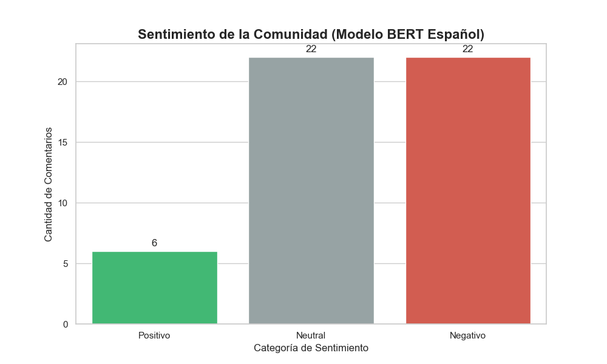
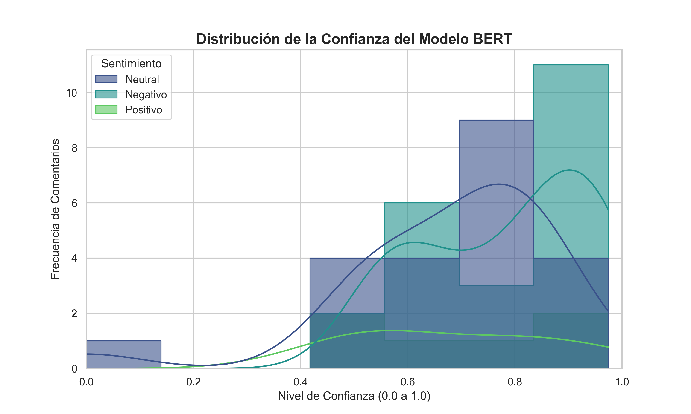
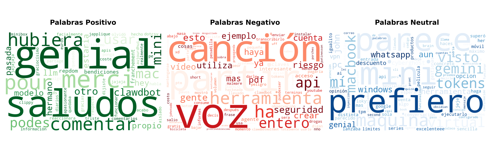

# Análisis de Sentimiento en YouTube con Deep Learning (BERT) 🤖📊

Este proyecto implementa un pipeline completo de Ciencia de Datos para extraer, procesar y analizar el sentimiento de comentarios en YouTube. Utilizamos el modelo **BETO** (BERT adaptado al español) para obtener una clasificación precisa que entiende el contexto, el sarcasmo y las negaciones.

## Hecho por
**Franco Corti** *Data Analyst & Estudiante de Licenciatura en Ciencia de Datos.  

## 🛠️ Tecnologías y Librerías
* **Extracción:** `google-api-python-client` (YouTube Data API v3).
* **Procesamiento de Lenguaje Natural (NLP):** `pysentimiento` (Transformer BETO), `re` (Regex).
* **Análisis de Datos:** `pandas`, `numpy`.
* **Visualización:** `matplotlib`, `seaborn`, `wordcloud`.
* **Entorno:** `python-dotenv`.

## 🧠 Paso a paso del desarrollo 

### 1. Extracción e Ingeniería de Datos (ETL)
Se desarrolló un script para conectarse a la API de YouTube, extrayendo comentarios crudos y metadatos asociados. 

### 2. Preprocesamiento "Suave" vs. "Agresivo"
* **Suave (Para BERT):** Se diseñó una limpieza que elimina URLs y ruido innecesario pero conserva emojis, signos de exclamación y mayúsculas, permitiendo que el Transformer capte la intensidad emocional.
* **Agresiva (Para Nubes de Palabras):** Se normalizó el texto a minúsculas y se aplicó una lista personalizada de **Stopwords** para eliminar palabras vacías de significado técnico.

### 3. Modelado con Deep Learning
Se integró el modelo de lenguaje **BETO**. A diferencia de los métodos basados en diccionarios, este modelo analiza la frase completa. El script calcula:
* **Sentimiento:** Clasificación en Positivo, Negativo o Neutral.
* **Confianza:** Un valor probabilístico (0.0 a 1.0) que indica la seguridad de la predicción de la IA.

### 4. Visualización de Resultados
Se crearon tres tipos de reportes visuales:
* **Gráficos de Barras:** Para la distribución general de sentimientos.
 
* **Histogramas de Confianza:** Para validar la robustez del modelo y detectar ambigüedades.
 
* **WordClouds:** Para el análisis semántico de temas recurrentes por categoría.
 

## 📁 Estructura de Carpetas
- `src/`: Scripts principales (`extraer_youtube.py`, `analizar_bert.py`, etc.).
- `data/`: Archivos CSV intermedios y finales.
- `output/`: Reportes gráficos generados.
- `requirements.txt`: Lista de dependencias del entorno.

## 🔧 Pasos para Correr el Proyecto

### 1. Clonar y Configurar Entorno
```bash
git clone [https://github.com/FrancoCorti/analisis-sentimiento-youtube-bert.git](https://github.com/FrancoCorti/analisis-sentimiento-youtube-bert.git)
cd analisis-sentimiento-youtube-bert
python -m venv venv
# Activar entorno (Windows)
.\venv\Scripts\activate
# Instalar librerías
pip install -r requirements.txt
```

### 2. Configuracion de Credenciales
Crea un archivo llamado .env en la raíz del proyecto (este archivo está ignorado por Git por seguridad). Agrega tu clave de API de Google Cloud de la siguiente manera:
```YOUTUBE_API_KEY=Tu_Clave_De_Google_Cloud_Aqui```

### 3. Orden de ejecucion
Para procesar los datos correctamente, ejecutá los scripts desde la terminal en el siguiente orden:
* **python src/extraer_youtube.py**: Descarga los comentarios del video seleccionado.
* **python src/limpiar_datos.py**: Aplica la limpieza necesaria para el modelo Transformer.
* **python src/analizar_bert.py**: Realiza el análisis de sentimiento y calcula la confianza.
* **python src/nube_palabras.py**: Genera las nubes de palabras por categoría de sentimiento.
* **python src/graficar_confianza.py**: Crea el histograma de validación estadística.


